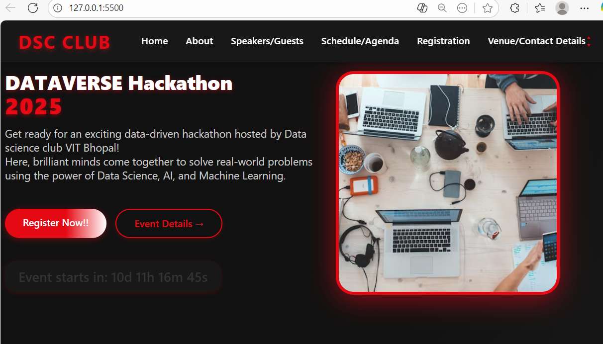
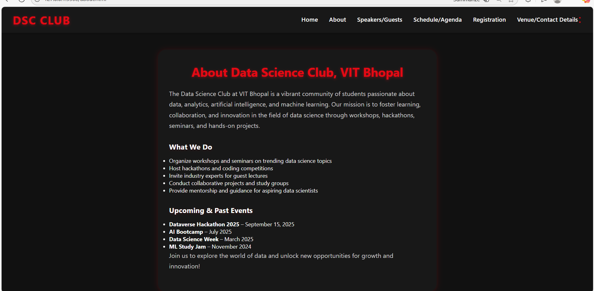
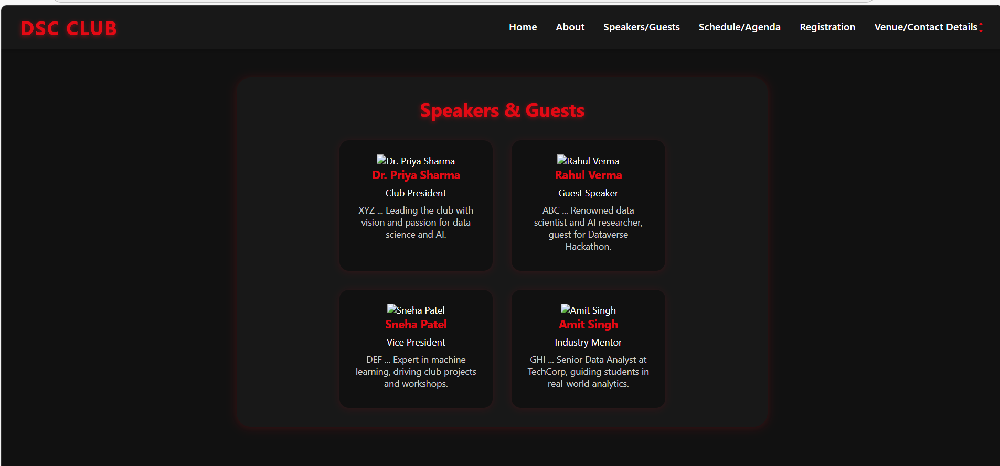
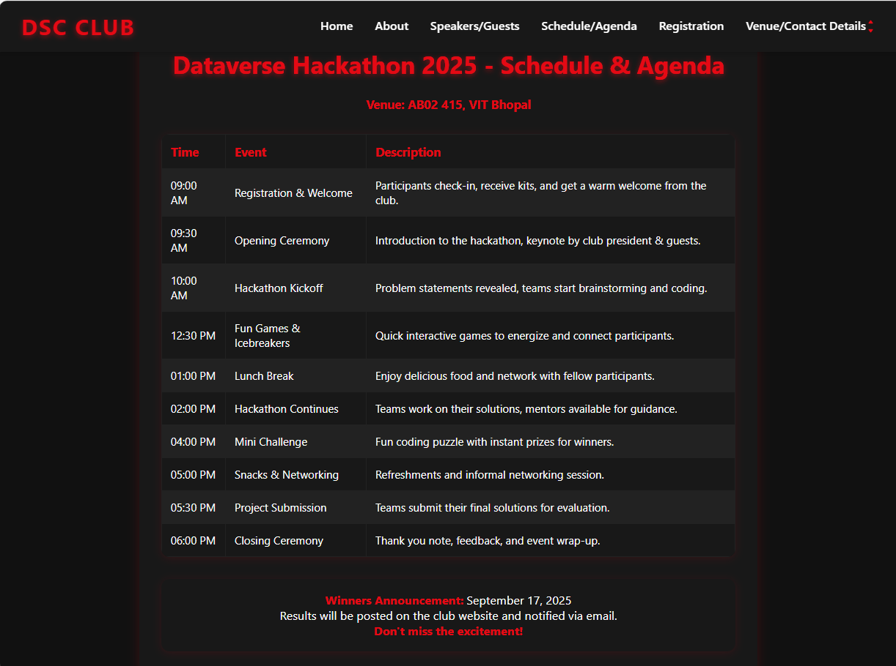
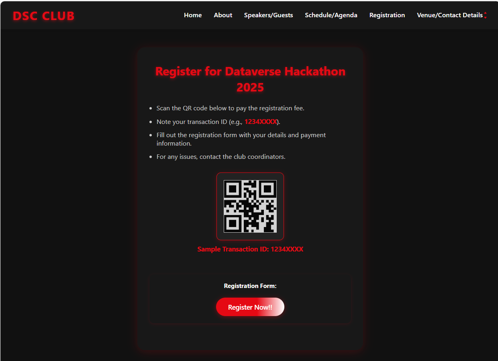
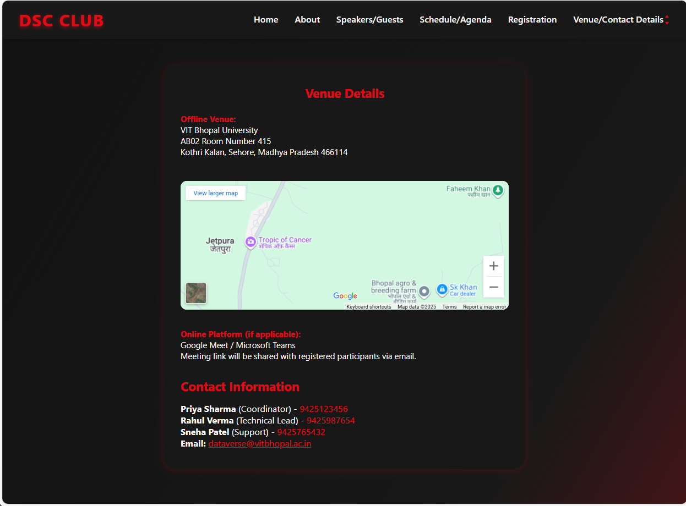

# College Event Website

A simple, responsive website created to showcase and manage college events. Hosted live on GitHub Pages.

## Live Demo

[https://poorva77.github.io/EVENT-WEBSITE/](https://poorva77.github.io/EVENT-WEBSITE/)

## Task

Designed and built a **basic college event website** to efficiently display event details, schedules, and contact information for students and attendees.

## Website Structure

- **Home (`index.html`):** Overview, event highlights, quick links.
- **About (`about.html`):** Club info, mission, and team.
- **Speakers (`speakers.html`):** Guest and club speakers.
- **Schedule (`schedule.html`):** Event agenda and timeline.
- **Registration (`registration.html`):** How to register, payment info.
- **Venue (`venue.html`):** Location, map, and contact details.

## Steps to Run Locally

1. Clone this repository:
git clone https://github.com/poorva77/EVENT-WEBSITE.git
2. Open the project folder.
3. Double-click `index.html` or open it in any browser.
4. To view the hosted version, use the Live Demo link above.

_No backend or server setup needed. The site runs as a static web application._

## Screenshots

## Challenges & Creative Additions

- **Challenges:** Making the layout adaptive for all screens and presenting information clearly. Optimizing visuals for speed and clarity was a key technical hurdle.

---

